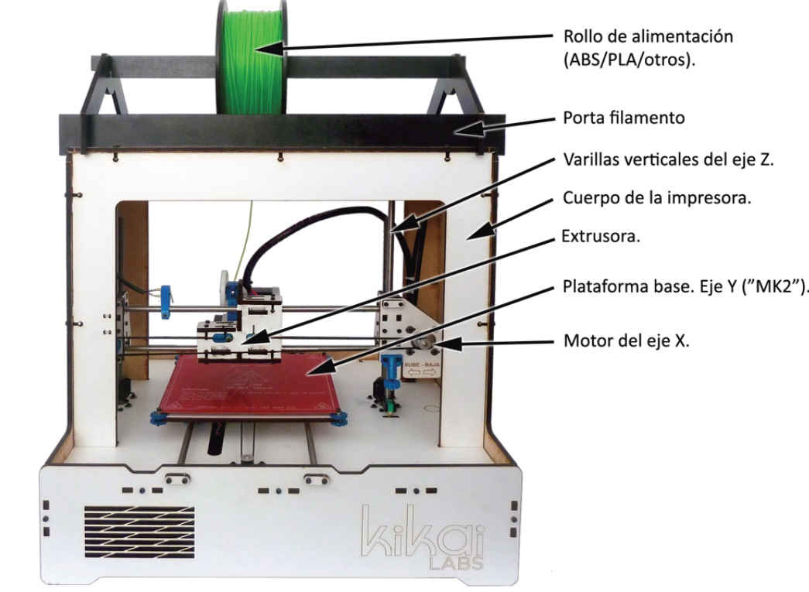
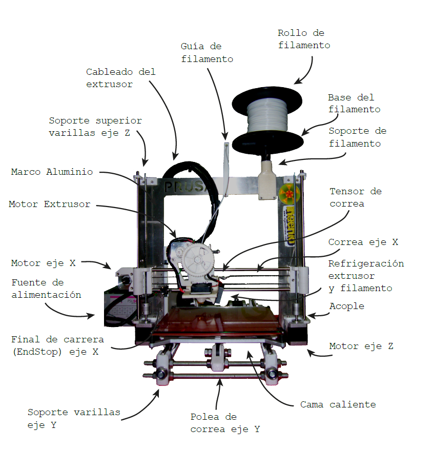
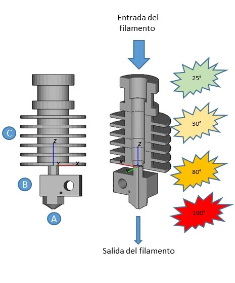
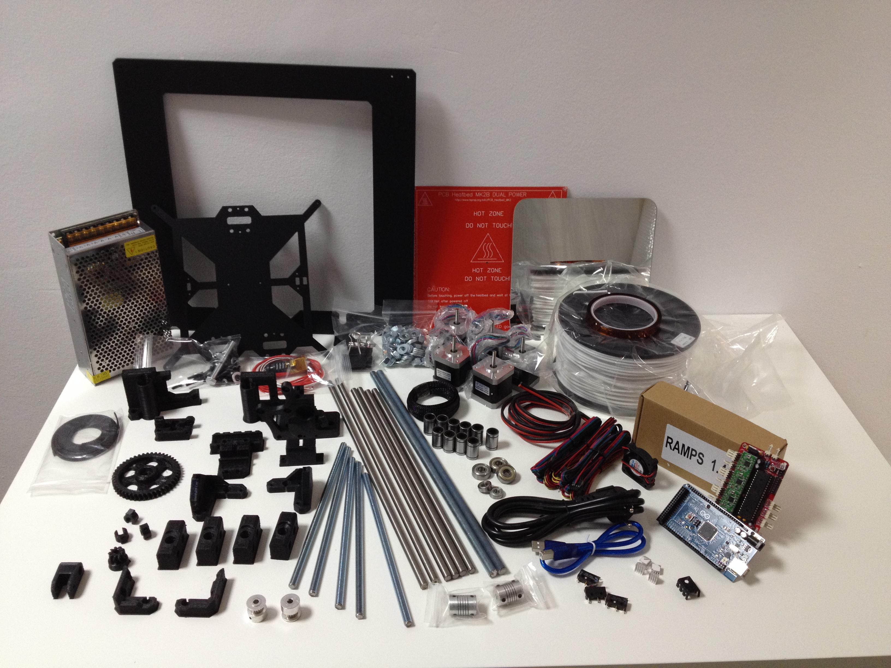
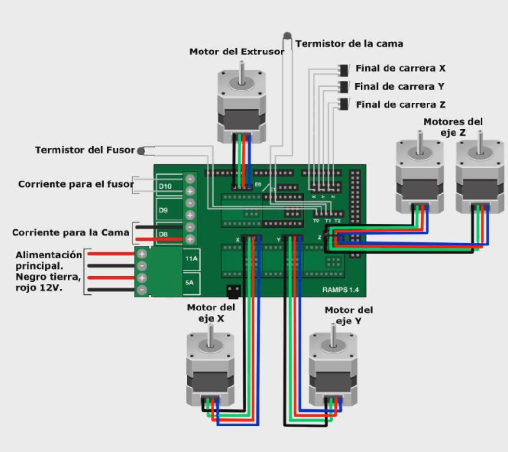

# SMARTI ETN

#Automated #TransportInfrastructures

# Laboratorio de Ingeniería de la Construcción of University of Granada

# 3DPrinting

## José Antonio Vacas @javacasm

## http://bit.ly/3Dsmartietn

# 3D Printer

## Extruder

## Structure

## Hot Bed

Fundamental para una buena adhesión.

## Electronic

## Kit 

