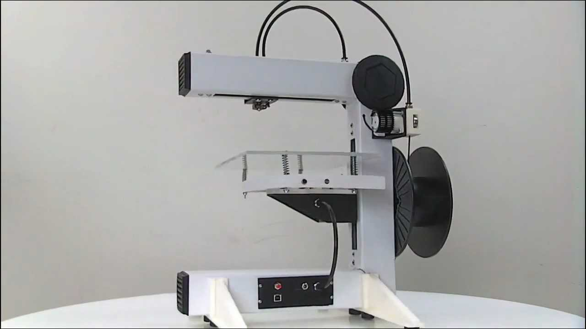
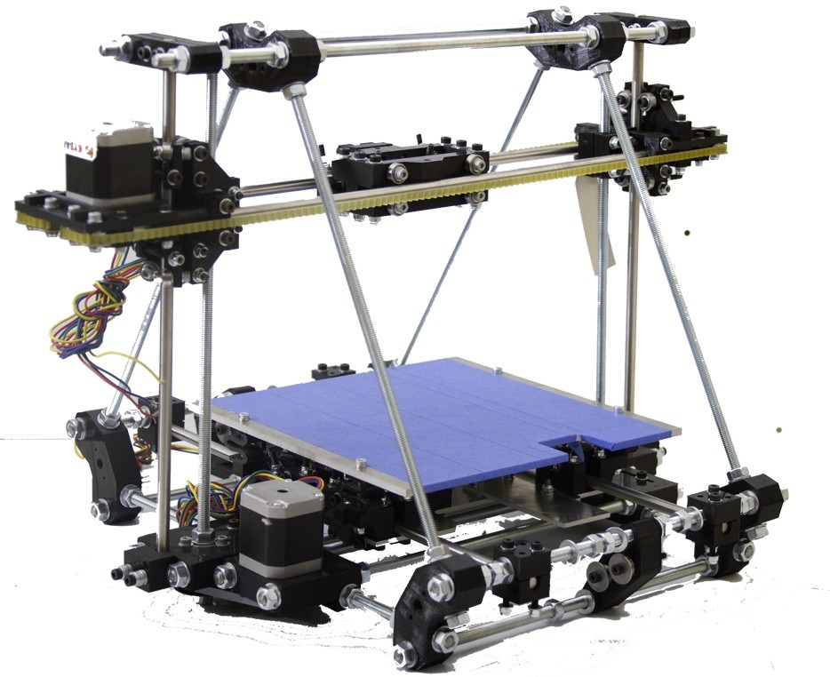

# SMARTI ETN

#Automated #TransportInfrastructures

# Laboratorio de Ingeniería de la Construcción of University of Granada

# 3DPrinting

## José Antonio Vacas @javacasm

## http://bit.ly/3Dsmartietn

