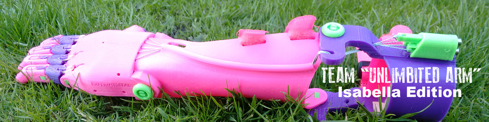
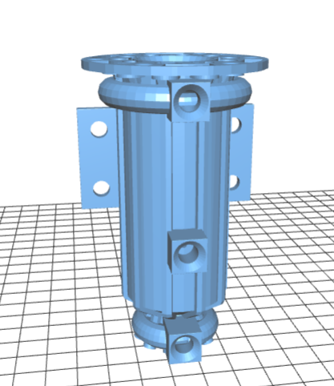

# SMARTI ETN

#Automated #TransportInfrastructures

# Laboratorio de Ingeniería de la Construcción of University of Granada

# 3DPrinting

## José Antonio Vacas @javacasm

## http://bit.ly/3Dsmartietn

# Applications

## Models

[Science Projects](https://www.thingiverse.com/MakerBotLearning/collections/science-projects)

## Easy prototiping

[Spinners](https://github.com/javacasm/Spinners)

## Math

## Lab material

## Protesic

## Aplicaciones para ingeniería

### Arquitectura

* Motors ([diseños](https://github.com/gNSortino/OSREngines))

 [[modelo]](https://www.thingiverse.com/thing:392115)[[historia del modelo]](http://3dprint.com/17716/3d-printed-jet-engine/)

### Industry

### Construction

### Food 

### Biology

